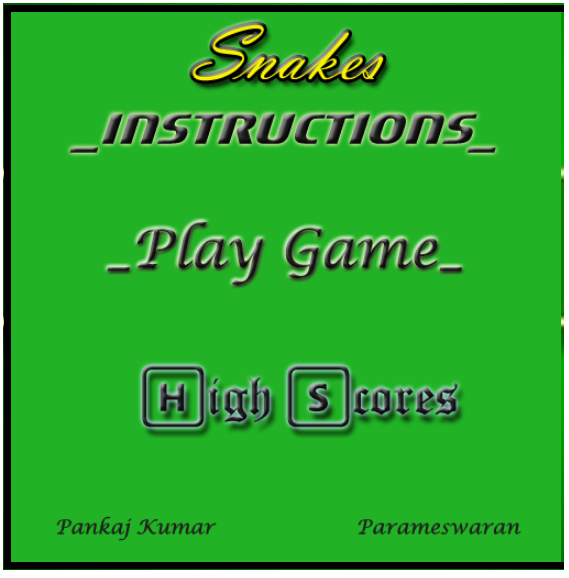
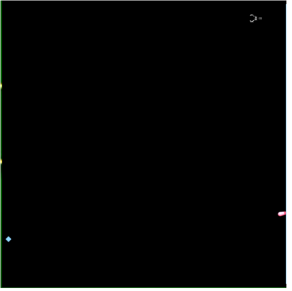
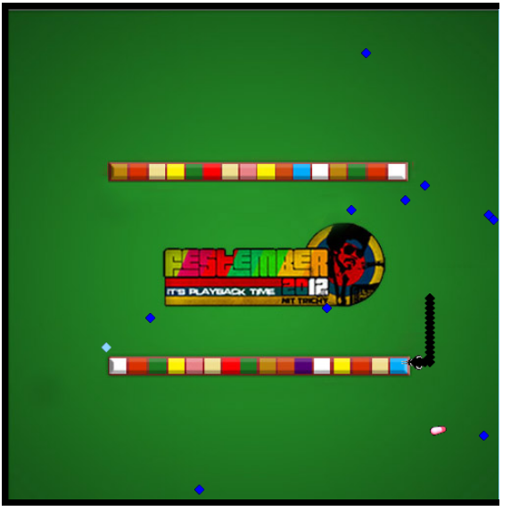
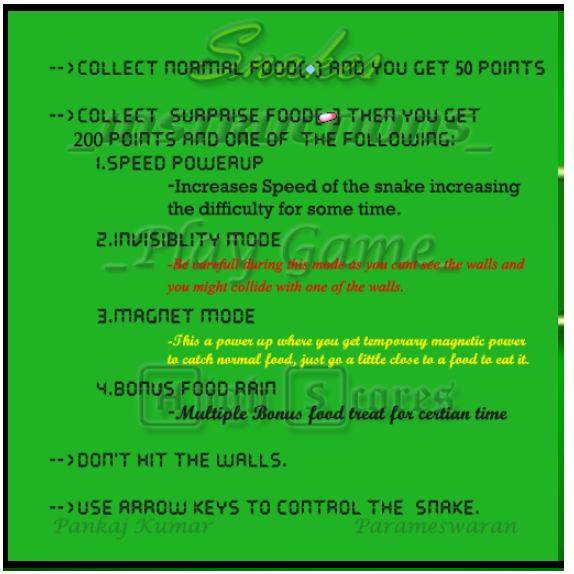

<h1>
Snakes
</h1>

A <b>Retro</b> Themed Classical Snakes game Which Has some more improved Features

such as
 
<ol>
<li>Bonus Food for Speed up.( evil food ) 
Increases Speed of the Snake, hence increasing the difficulty  
level for the player for some time.
</li>
<li>Invisibility Bonus ( evil food )  
On picking up this food, the whole arena blacks out , leaving the 
snake stranded in a dark evil scenario with nothing but its head visible 
to the player, its now only based on the player's memory 
of the position of mazes, for him to guide it.Cant be more evil rite ? 
Dont worry, if the snake survives for a few moments it will escape it  
and come back to the normal world.

</li>
<li>Magnet Bonus ( awesome food ) 
Yes, You become a food magnet, just go near a food, if you are in 
a certain vicinity of the food, its taken up.
But dont be too excited 
its just for some time.
</li>
<li>Food Rain ( awesome food ) 
Just like mario's Bonus round, here we have a bonus food rain, 
Eat em ALL

</li>
</ol>
 
And other rules follow
<ol>
<li> Dont hit the walls ( seriously ?? isnt that obvious ? )</li>

<li> To play use arrow keys up down left right ( duhh )</li>

<li> 50 points for normal food</li>

<li> 200 points for Bonus food</li>
</ol>

